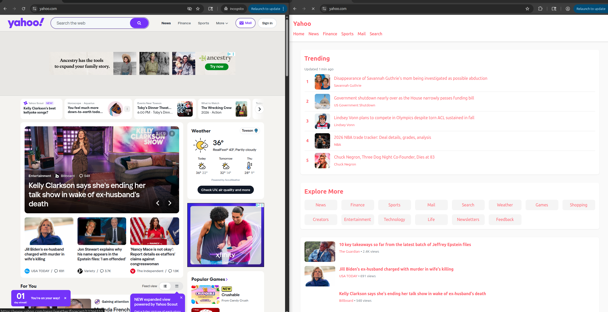

# Through a Browser, Darkly
A mitmproxy-based proxy that flexibly munges web pages using AI.

NOTE: We've found that Cerebras's gpt-oss-120b model is the fastest.

## Setup
* Create python virtual environment:
```
python3 -m venv python_env
```
* Activate python virtual environment:
```
source python_env/bin/activate
```
* Install dependencies
```
pip install dotenv mitmproxy openai
```
* Create a .env file from .env.example and fill in your API keys as desired
* Start proxy app:
```
python3 app.py
```

### Chrome setup: Create a Darkly profile
* Create a new Chrome profile
* Install Proxy Switcher Chrome extension: https://chromewebstore.google.com/detail/onnfghpihccifgojkpnnncpagjcdbjod
* Set to manual proxy, address 127.0.0.1, port 8899, server type http. For example: 
* Make sure to click the green check mark (see red arrow in the image) to save the changes!

### Add the MITM certificate to Chrome
* Go to http://mitm.it/ in the Darkly browser profile
* Click on the "Get mitmproxy-ca-cert.pem" button
* Install the certificate for your browser: Settings > Privacy and Security > Security > Manage certificates > Custom > Trusted Certificates > Import

## Browse the web, configure the AI behavior
You can customize the AI's behavior by visiting **http://dark.ly** in your browser (while the proxy is running).
* Edit the system instructions to change how pages are processed by the AI.
* Save instructions to `ai_instructions.txt`.
* Reset to default settings at any time.
* Example additions:
  * "Convert all proper nouns to bold text"
  * "Add a link to the wikipedia page for each proper noun."
  * "Write everything in pig latin."
  * "If text in the original html appears to be AI generated, put it in double square brackets."

## Examples



